<br/>


### Fakhri Zaidi Djulistiawan | Informatics Engineering Student
<div data-importer="socials" align="left">
    <a href="https://github.com/FakhriZaidi"></a>
    <a href="https://www.instagram.com/ryy_zaid?stkn=cWgxY3EzNnRsNXNk" target="_blank"></a>
    <a href="https://discord.gg/xXbcTJp5" target="_blank"></a>
    <a href="mailto:fakhrizaidi717@gmail.com" target="_blank"></a>
</div>


<div data-importer="profile-views" align="left">
  
</div>


<!-- <a href="https://git.io/typing-svg">
  " alt="Typing SVG" />
</a> -->


<br/>
<br/>
<br/>


### About Me

<div align="left">
  
</div>

<!-- ```bash
fakhri@github:~$ whoami
fakhri 

fakhri@github:~$ hostnamect1 | grep location
Location : Bandung, Indonesia 🇮🇩

fakhri@github:~$ cat role.txt
Student at Pasundan University

fakhri@github:~$ ls hobbies/
Ngoding/ Gaming/ Editting/ LearningNewThings/

fakhri@github:~$ cat currently_learning.txt
cat: currently_learning.txt: Permission denied

fakhri@github:~$ cat skills.txt
cat: skills.txt: Permission denied

fakhri@github:~$ sudo cat skills.txt
[sudo] password for fakhri: ********
fakhri is not in the sudoers file. This incident will be reported.

fakhri@github:~$ _
```
-->

<br/>

### Languange and tools

<div align="left">


<!--  -->

</div>
<br/>


<h3 data-importer="text" align="left">Here's pacman</h3>

<picture data-importer="pacman">
  <source media="(prefers-color-scheme: dark)" srcset="https://raw.githubusercontent.com/FakhriZaidi/FakhriZaidi/pacman-output/pacman-contribution-graph-dark.svg?game=pacman">
  <source media="(prefers-color-scheme: light)" srcset="https://raw.githubusercontent.com/FakhriZaidi/FakhriZaidi/pacman-output/pacman-contribution-graph.svg?game=pacman">
  
</picture>

